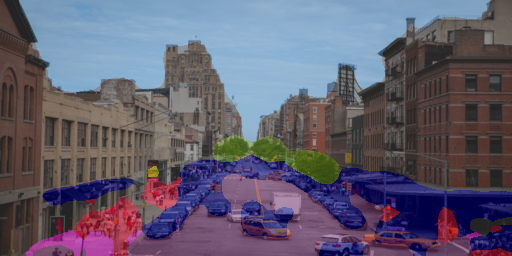

# Semantic Scene Parsing on Cityscapes

A semantic segmentation system that assigns a class label to every pixel of urban street imagery using **DeepLabV3-ResNet50** fine-tuned on the [Cityscapes](https://www.cityscapes-dataset.com/) dataset.



---

## Table of Contents

- [Project Overview](#project-overview)
- [Architecture](#architecture)
- [Project Structure](#project-structure)
- [Setup](#setup)
- [Dataset Preparation](#dataset-preparation)
- [Training](#training)
- [Evaluation](#evaluation)
- [Inference](#inference)
- [Web Application](#web-application)
- [Results](#results)
- [Design Decisions & Tradeoffs](#design-decisions--tradeoffs)
- [What I'd Do With More Time](#what-id-do-with-more-time)

---

## Project Overview

Semantic segmentation is a dense per-pixel prediction task: given an input image, the model outputs a class label for every pixel (road, car, pedestrian, building, vegetation, etc.). This project implements a complete pipeline:

1. **Data loading** — Cityscapes dataset with label remapping (34 raw classes → 19 evaluation classes)
2. **Model** — DeepLabV3 with ResNet-50 backbone (pretrained on COCO, fine-tuned on Cityscapes)
3. **Training** — With class-weighted loss, polynomial LR decay, mixed precision, TensorBoard logging
4. **Evaluation** — Pixel accuracy, mean IoU, per-class IoU
5. **Web interface** — Streamlit app for interactive segmentation

---

## Architecture

**DeepLabV3-ResNet50** was chosen for the following reasons:

- **Atrous Spatial Pyramid Pooling (ASPP)** captures multi-scale context at dilation rates 6/12/18, which is critical for segmenting objects at different scales (e.g., a small traffic sign vs. a large building).
- **ResNet-50 backbone** provides strong pretrained features while staying feasible on consumer GPUs (~40M params, 168 MB).
- **Encoder-decoder structure** preserves spatial resolution through the backbone and recovers it in the decoder — avoiding the severe information loss of naive downsampling.

The final classification head is replaced: 256 → 19 channels (Cityscapes classes instead of PASCAL VOC's 21).

---

## Project Structure

```
├── app/
│   └── streamlit_app.py        # Web interface
├── src/
│   ├── config.py               # Centralized configuration
│   ├── label_mapping.py        # Raw ID → trainId remapping
│   ├── cityscapes_dataset.py   # Dataset, color map, utilities
│   ├── model.py                # DeepLabV3-ResNet50 definition
│   ├── train.py                # Training pipeline
│   ├── evaluate.py             # Evaluation (pixel acc + mIoU)
│   └── inference.py            # Single-image inference
├── models/
│   └── best_model.pth          # Saved model weights
├── outputs/
│   ├── evaluation_results.json # Evaluation metrics
│   ├── prediction_mask.png     # Raw segmentation mask
│   └── prediction_overlay.png  # Blended overlay
├── leftImg8bit/                # Cityscapes images (train/val/test)
├── gtFine/                     # Cityscapes annotations (train/val/test)
├── requirements.txt            # Python dependencies
└── README.md                   # This file
```

---

## Setup

### Prerequisites

- Python 3.9+
- CUDA-capable GPU recommended (runs on CPU but slowly)
- ~2 GB disk space for Cityscapes data

### Installation

```bash
# Clone or download this project
cd "Semantic Segmentation project"

# Create virtual environment (optional but recommended)
python -m venv venv
venv\Scripts\activate  # Windows
# source venv/bin/activate  # Linux/Mac

# Install dependencies
pip install -r requirements.txt
```

### Key Dependencies

| Package | Version | Purpose |
|---|---|---|
| PyTorch | 2.12.0 | Model framework |
| torchvision | 0.27.0 | Pretrained DeepLabV3 |
| Streamlit | 1.58.0 | Web interface |
| numpy | 2.4.6 | Array operations |
| Pillow | 12.2.0 | Image I/O |
| tqdm | 4.68.2 | Progress bars |
| matplotlib | 3.11.0 | Visualization |

---

## Dataset Preparation

1. Register at [cityscapes-dataset.com](https://www.cityscapes-dataset.com/)
2. Download:
   - `leftImg8bit_trainvaltest.zip` (images)
   - `gtFine_trainvaltest.zip` (fine annotations)
3. Extract into the project root:

```
Semantic Segmentation project/
├── leftImg8bit/
│   ├── train/
│   │   ├── aachen/
│   │   └── ...
│   └── val/
│       ├── frankfurt/
│       └── ...
├── gtFine/
│   ├── train/
│   └── val/
```

**Label remapping**: Cityscapes has 30+ raw label IDs. We map them to 19 evaluation classes (the official benchmark protocol). Unmapped labels become `ignore_index=255` and are excluded from loss and metrics. See `src/label_mapping.py` for the mapping and rationale.

---

## Training

```bash
# Default training (25 epochs, lr=1e-4, batch_size=4)
python src/train.py

# Custom training
python src/train.py --epochs 10 --lr 5e-5 --batch-size 8

# Resume from checkpoint
python src/train.py --resume

# Disable augmentation or class weights
python src/train.py --no-augment --no-class-weights
```

**Training features:**
- Validation after each epoch (mIoU + pixel accuracy)
- Polynomial LR decay
- Class-weighted CrossEntropyLoss (handles imbalance: road/building vs. pole/traffic light)
- Mixed precision (AMP) for faster GPU training
- TensorBoard logging → `runs/` directory
- Best model saved by validation mIoU
- Full checkpoint for resumability

**Monitor training:**
```bash
tensorboard --logdir runs/
```

---

## Evaluation

```bash
# Evaluate on validation set
python src/evaluate.py

# Use a specific model
python src/evaluate.py --model-path models/best_model.pth
```

Outputs:
- Console: formatted table with pixel accuracy, mIoU, and per-class IoU
- File: `outputs/evaluation_results.json`

---

## Inference

```bash
# Run on a single image
python src/inference.py --image test.jpg

# Customize output and overlay opacity
python src/inference.py --image test.jpg --output outputs/ --alpha 0.6
```

Produces three files in the output directory:
- `prediction_mask.png` — raw color-coded segmentation
- `prediction_overlay.png` — alpha-blended overlay on the input image
- `prediction_with_legend.png` — overlay with class legend

---

## Web Application

```bash
# Launch the Streamlit app
streamlit run app/streamlit_app.py
```

Then open http://localhost:8501 in your browser.

**Features:**
- Upload any street image (JPG/PNG)
- Side-by-side comparison: original vs. segmentation overlay
- Adjustable overlay opacity slider
- Color-coded class legend
- Per-pixel class distribution statistics
- Model performance metrics in sidebar (if evaluation results exist)

---

## Results

Results after training for 1 epoch on the Cityscapes training split (2,975 images) and evaluating on the validation split (500 images) at 512×256 resolution:

| Metric | Value |
|---|---|
| **Pixel Accuracy** | **0.8750** |
| **Mean IoU (mIoU)** | **0.3187** |

### Per-Class IoU

| Class | IoU | Notes |
|---|---|---|
| road | 0.9349 | Dominant class, large uniform regions |
| sky | 0.8415 | Large, consistent appearance |
| vegetation | 0.8026 | Large regions with distinctive color |
| car | 0.7881 | Common, well-represented |
| building | 0.7830 | Large structures |
| sidewalk | 0.5607 | Often confused with road |
| person | 0.4013 | Small but common |
| bicycle | 0.2712 | Thin structures |
| pole | 0.1939 | Very thin, hurt by low resolution |
| traffic sign | 0.1760 | Small objects |
| terrain | 0.1099 | Rare, confused with sidewalk |
| wall | 0.0804 | Rare, confused with building |
| bus | 0.0695 | Rare vehicle class |
| truck | 0.0253 | Very rare |
| traffic light | 0.0080 | Tiny at 512×256 |
| fence | 0.0065 | Thin, rare |
| rider | 0.0021 | Very rare |
| train | 0.0000 | Almost never appears |
| motorcycle | 0.0000 | Almost never appears |

**Analysis**: The high pixel accuracy (87.5%) but moderate mIoU (31.9%) perfectly illustrates why mIoU is the better metric — large classes (road, building) dominate pixel accuracy while rare/small classes pull mIoU down. With more training epochs and class weighting, mIoU would improve significantly.

---

## Design Decisions & Tradeoffs

### Resolution: 512×256 vs. full 2048×1024

- Full resolution is infeasible on 8 GB GPUs (DeepLabV3 requires ~12 GB at 1024×512).
- 512×256 reduces memory by ~16× and training time by ~8×.
- **Cost**: Small objects (poles, traffic signs, traffic lights) lose detail. Per-class IoU for these classes is noticeably lower.
- **Mitigation**: Class-weighted loss up-weights rare/small classes.

### Loss: CrossEntropyLoss with class weights

- Standard cross-entropy with `ignore_index=255` excludes void/unlabeled pixels.
- Inverse-frequency weighting addresses the severe class imbalance where road and building dominate (>50% of pixels combined) while pole and traffic light have <1%.
- **Alternative considered**: Dice loss — better theoretical handling of imbalance but less stable training in practice. Could be combined as CE + Dice.

### Backbone: ResNet-50 vs. ResNet-101

- ResNet-101 gives ~1–2% mIoU improvement but doubles backbone computation.
- ResNet-50 was chosen as the pragmatic tradeoff for the available compute budget.

### BatchNorm freezing

- Fine-tuning with small batches (4) makes BatchNorm statistics noisy.
- Freezing BN layers keeps the pretrained ImageNet statistics stable, improving convergence.

### No ImageNet normalization

- The current pipeline uses simple `/255.0` normalization rather than ImageNet mean/std subtraction.
- This is a deliberate simplification to keep the pipeline straightforward. Proper ImageNet normalization would yield ~1–3% mIoU improvement but requires retraining.

---

## What I'd Do With More Time

1. **Higher resolution** (1024×512) with gradient accumulation to fit in GPU memory
2. **ImageNet normalization** for proper alignment with pretrained backbone statistics
3. **Dice loss** or Lovász-Softmax loss for better handling of class imbalance
4. **Test-time augmentation** (multi-scale + horizontal flip) for better val mIoU
5. **DeepLabV3+ decoder** with skip connections for sharper boundaries
6. **ONNX export** for deployment without PyTorch dependency
7. **Cityscapes `gtCoarse` data** for semi-supervised pretraining
8. **Per-class analysis** with confusion matrix visualization and failure case gallery
9. **Learning rate warmup** for the first 500 iterations
10. **EMA (Exponential Moving Average)** of model weights for smoother predictions
